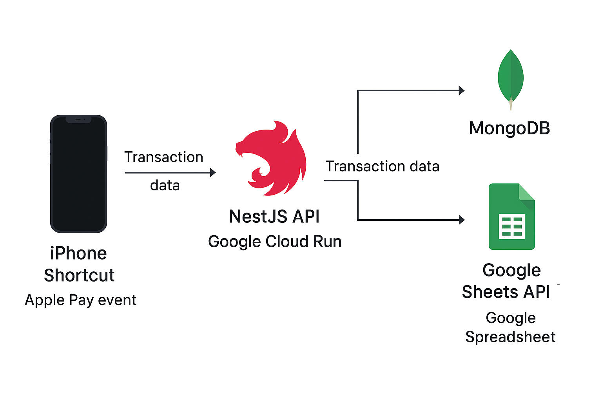

---

<p align="center">
  
</p>

<p align="center">
  <strong>A NestJS API for logging iPhone payments to MongoDB and Google Sheets</strong><br/>
  Efficient, serverless transaction tracking powered by Google Cloud Run and Shortcut automations.
</p>

<p align="center">
  <a href="https://www.npmjs.com/~nestjscore" target="_blank"></a>
  <a href="https://www.npmjs.com/~nestjscore" target="_blank"></a>
  <a href="https://discord.gg/G7Qnnhy" target="_blank"></a>
  <a href="https://twitter.com/nestframework" target="_blank"></a>
</p>

---

## 🚀 Overview

This NestJS API serves as a serverless backend that enables:

* Generating access tokens via API keys.
* Receiving transaction data from an iOS Shortcut automation after Apple Pay events.
* Storing transactions in MongoDB.
* Appending them to a Google Spreadsheet.

Hosted on **Google Cloud Run**, it's fully scalable and optimized for event-driven usage.

---

## 🧰 Tech Stack

* **Framework**: [NestJS](https://nestjs.com/)
* **Database**: MongoDB
* **Spreadsheet Integration**: Google Sheets API
* **Hosting**: Google Cloud Run
* **Automation Trigger**: Apple Shortcuts (on iPhone)

---

## 📦 Installation

```bash
npm install
```

---

## 🛠️ Running the Project

```bash
# Development mode
npm run start

# Watch mode
npm run start:dev

# Production build
npm run start:prod
```

---

## 🧪 Testing

```bash
# Unit tests
npm run test

# End-to-end tests
npm run test:e2e

# Test coverage
npm run test:cov
```

---

## 🔐 Usage

1. **Request Access Token**

Send a POST request with your API key:

```http
POST /auth/login
Content-Type: application/json

{
  "secret_token": "your-api-key"
}
```

Response:

```json
{
  "access_token": "eyJhbGciOiJIUzI1NiIs..."
}
```

2. **Send a Transaction**

Your iOS Shortcut sends a POST request like this:

```http
POST /transactions
Authorization: Bearer <access_token>
Content-Type: application/json

{
    "amount": 4.47,
    "card": "Swile",
    "currency": "EUR",
    "date": "2025-05-05",
    "location": "Dijon, Bourgogne-Franche-Compté",
    "store": "ALDI"
}

```

---

## 🧾 Data Flow

1. Shortcut automation triggers payment event.
2. Sends data with the access token to the API.
3. Transaction is saved to **MongoDB**.
4. A new row is appended to your **Google Spreadsheet**.
<p align="left">  </p>
---

## 🚀 Deployment

This API runs on [Google Cloud Run](https://cloud.google.com/run):

1. Build Docker image:

   ```bash
   docker build -t gcr.io/YOUR_PROJECT_ID/your-app-name .
   ```
2. Push to Google Container Registry:

   ```bash
   docker push gcr.io/YOUR_PROJECT_ID/your-app-name
   ```
3. Deploy:

   ```bash
   gcloud run deploy your-app-name \
     --image gcr.io/YOUR_PROJECT_ID/your-app-name \
     --platform managed \
     --region YOUR_REGION \
     --allow-unauthenticated
   ```

---

## 📚 Resources

* [NestJS Docs](https://docs.nestjs.com)
* [MongoDB Docs](https://www.mongodb.com/docs/)
* [Google Sheets API](https://developers.google.com/sheets/api)
* [Google Cloud Run Docs](https://cloud.google.com/run/docs)
* [Apple Shortcuts Guide](https://support.apple.com/guide/shortcuts)

---

## 🤝 Contributing

Feel free to submit issues, suggest improvements, or fork and PR. The project welcomes any community input that improves reliability or usability.

---

## 📄 License

This project is [MIT licensed](./LICENSE).
